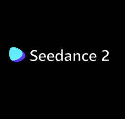

# seedance2-api-gui

Desktop GUI for generating videos with Seedance 2.0 via the MuAPI. Supports Text-to-Video, Image-to-Video, Omni Reference, Video Edit, and Video Extension.



## Features

- **Text to Video** — generate video from a text prompt
- **Image to Video** — animate a static image with a prompt
- **Omni Reference** — use a reference image for style/content guidance (not as keyframe)
- **Video Edit** — edit an existing video with a prompt + reference image
- **Extend Video** — extend a previously generated video
- **Job queue** — run multiple generations concurrently without blocking the UI
- **Persistent history** — generated videos survive across app restarts
- **Video preview** — thumbnail preview with system player playback
- **Settings** — manage API key from within the app
- **Cross-platform** — Linux, Windows, macOS

## Requirements

- Python 3.10+
- ffmpeg (for video thumbnail extraction)
- A [MuAPI](https://muapi.ai) API key

## Install

### Linux / macOS

```bash
git clone https://github.com/youruser/seedance2-api-gui.git
cd seedance2-api-gui
./install.sh
```

This creates a virtual environment, installs all dependencies, and adds a desktop launcher (Linux) or app bundle (macOS).

### Windows

```
git clone https://github.com/youruser/seedance2-api-gui.git
cd seedance2-api-gui
install.bat
```

This creates a virtual environment, installs dependencies, and adds Desktop + Start Menu shortcuts.

## Run

### Linux / macOS
```bash
./run.sh
```
Or search for "Seedance" in your app launcher.

### Windows
Double-click `run.bat` or use the Desktop shortcut.

## Configuration

Set your MuAPI key in one of two ways:

1. **In the app**: click the gear icon (top right) and paste your key
2. **Manually**: create a `.env` file:
   ```
   MUAPI_API_KEY=your_key_here
   ```

## API Usage (Python)

```python
from seedance_api import SeedanceAPI

api = SeedanceAPI()

# Text to Video
result = api.text_to_video(
    prompt="A cinematic shot of a futuristic city with neon lights",
    aspect_ratio="16:9",
    duration=5,
    quality="basic"
)

# Wait for completion
completed = api.wait_for_completion(result['request_id'])
print(f"Video URL: {completed['url']}")
```

## API Endpoints

| Mode | Endpoint | Key Parameters |
|------|----------|----------------|
| Text to Video | `seedance-v2.0-t2v` | `prompt`, `aspect_ratio`, `duration`, `quality` |
| Image to Video | `seedance-v2.0-i2v` | `prompt`, `images_list`, `aspect_ratio`, `duration`, `quality` |
| Omni Reference | `seedance-v2.0-i2v` | Same as I2V, uses image as style reference |
| Video Edit | `seedance-v2.0-video-edit` | `prompt`, `video_urls`, `images_list`, `aspect_ratio`, `quality` |
| Extend Video | `seedance-v2.0-extend` | `request_id`, `prompt`, `duration`, `quality` |

## Project Structure

```
seedance2-api-gui/
├── seedance_ui.py       # Flet desktop GUI
├── seedance_api.py      # MuAPI client
├── requirements.txt     # Python dependencies
├── install.sh           # Linux/macOS installer
├── install.bat          # Windows installer
├── run.sh               # Linux/macOS launcher
├── run.bat              # Windows launcher
├── .env                 # API key (not committed)
├── history.json         # Persistent generation history
└── output/              # Downloaded videos
```

## License

MIT

## Credits

- Based on [Anil-matcha/Seedance-2.0-API](https://github.com/Anil-matcha/Seedance-2.0-API)
- API provided by [MuAPI](https://muapi.ai)
- GUI built with [Flet](https://flet.dev)
